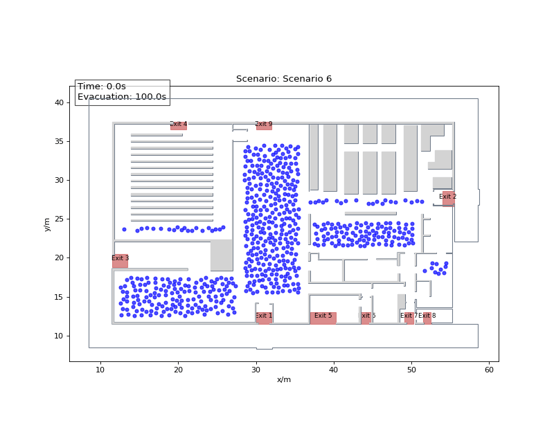

# Pedestrian Evacuation Analysis with JuPedSim

<p align="center">
  
  
  
  <a href="https://github.com/Kandil2001/Jupedsim-Evacuation-Analysis/actions/workflows/environment-check.yml">
    
  </a>
  
  <a href="https://kandil2001.github.io/projects/pedestrian-simulation.html">
    
  </a>
</p>

A completed JuPedSim-based evacuation study for a university building layout.

The project explores how pedestrian placement, exit assignment, and scenario assumptions affect trajectories and total evacuation time. It is a simulation and analysis exercise, not a certified building-safety assessment or a globally optimized evacuation model.

<p align="center">
  
</p>

## Main features

- building geometry loaded from a WKT file
- nine manually defined exit areas
- configurable pedestrian spawn areas and group sizes
- scenario-specific exit assignments
- agent placement using JuPedSim distribution utilities
- SQLite trajectory output and notebook animation
- runtime and evacuation-time comparison between scenarios
- selected setup calculations using NumPy, Numba, and `ThreadPoolExecutor`

## Study setup

The building is represented as a walkable geometry with exit polygons placed around the available doors. Pedestrians are generated inside selected spawn areas and assigned to exits according to the active scenario.

Each scenario can change:

- active spawn areas
- group sizes
- available exits
- walking-speed parameters
- time-gap settings
- exit-assignment restrictions

This makes it possible to compare defined evacuation scenarios without rebuilding the complete setup.

## Simulation workflow

The workflow in `EvacuationAnalysis.ipynb`:

1. loads the building geometry from `HC.wkt`
2. defines exit and spawn polygons
3. generates valid initial pedestrian positions
4. assigns an exit to each pedestrian group
5. configures and runs the JuPedSim simulation
6. saves trajectories and calculates evacuation time
7. animates and compares the scenarios

The exit-assignment logic uses exit centroids together with scenario-specific restrictions. The geometrically nearest door is not always the most sensible route through the building, so the restrictions encode the assumptions of each scenario.

## Reproducible environment

The notebook metadata records Python `3.12.8`. The repository now provides a current reproducibility baseline established on 20 July 2026:

- `.python-version` records Python `3.12.8`
- `requirements.txt` pins the top-level notebook packages
- GitHub Actions installs the pinned environment and runs `pip check`
- `scripts/check_environment.py` verifies exact package versions and exercises the notebook's JuPedSim, PedPy, Shapely, NumPy, Numba, SQLite-writer, and distribution APIs

This baseline is not claimed to reproduce the original development machine byte for byte. It establishes a documented environment that can be tested continuously from the current repository state.

The automated check does not execute all six evacuation scenarios. It performs a small compatibility simulation so dependency or API breakage is detected without turning CI into a long production run.

## Running the notebook

```bash
git clone https://github.com/Kandil2001/Jupedsim-Evacuation-Analysis.git
cd Jupedsim-Evacuation-Analysis
python -m venv .venv
source .venv/bin/activate
python -m pip install --upgrade pip
python -m pip install -r requirements.txt
python -m pip check
python scripts/check_environment.py
jupyter notebook EvacuationAnalysis.ipynb
```

On Windows PowerShell, activate the environment with:

```powershell
.venv\Scripts\Activate.ps1
```

## Repository structure

```text
EvacuationAnalysis.ipynb          simulation and analysis workflow
HC.wkt                            building geometry
.python-version                   recorded notebook Python version
requirements.txt                  pinned top-level environment
scripts/check_environment.py      dependency and API compatibility smoke test
.github/workflows/                automated environment verification
figures/                           selected animation used in the README
```

## Scope and limitations

This completed repository is an educational pedestrian-dynamics study.

Its documented scope is:

- one building geometry
- manually defined exits and spawn areas
- scenario-based exit restrictions
- centroid-informed assignment logic
- trajectory and evacuation-time comparison
- no experimental calibration

The project does **not** calculate a globally optimal path through the complete geometry. It also does not establish regulatory compliance, crowd safety certification, or experimentally validated evacuation predictions.

Possible follow-up research includes path-based exit assignment, sensitivity analysis, additional layouts, repeated stochastic runs, and validation against measured pedestrian-flow data.

## Acknowledgments

This project was developed for the Pedestrian Dynamics course at Bergische Universität Wuppertal.

Thanks to **Mohcine Chraibi** for supervision and guidance, and to the JuPedSim development team for the simulation framework.

## Author

Ahmed Kandil — [Portfolio](https://kandil2001.github.io/) · [LinkedIn](https://www.linkedin.com/in/ahmed-kandil03/) · [ORCID](https://orcid.org/0009-0007-2724-4565)

Released under the [MIT License](LICENSE).
